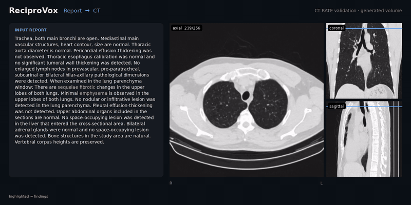
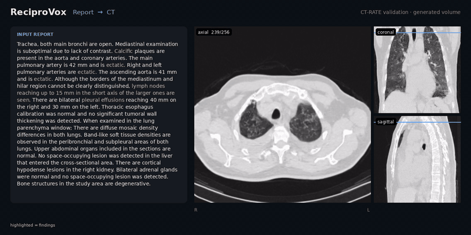
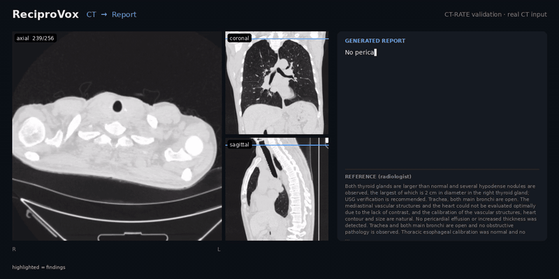
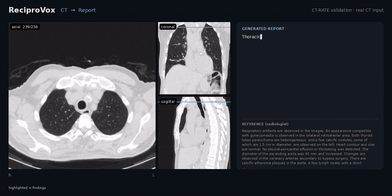

<div align="center">

# ReciproVox

**One autoregressive model that writes chest CT volumes from radiology reports — and reports from CT volumes.**

</div>

<table>
<tr>
<td align="center"><b>Report → CT</b></td>
</tr>
<tr>
<td></td>
</tr>
<tr>
<td></td>
</tr>
<tr>
<td align="center"><b>CT → Report</b></td>
</tr>
<tr>
<td></td>
</tr>
<tr>
<td></td>
</tr>
</table>

<sub>All cases are from the CT-RATE validation split, which is never seen in training. Report → CT shows the
generated volume next to its input report; CT → Report types out the generated report next to the real input CT,
with the radiologist's report below for reference. Highlighted terms are findings (negated mentions are not
highlighted). Full-resolution videos: <code>demos/*.mp4</code>.</sub>

---

## How it works

A CT volume is written as a sequence of **4,096 discrete tokens**: the 256³ volume is cut into a 16 × 16 × 16 grid
of 16³-voxel blocks, and each block is replaced by its nearest entry in an **atlas codebook** of 262,144 real
CT blocks. A single Qwen3-8B language model, extended with one token per codebook entry, is trained on both
directions at once; a task token selects the direction.


- **Atlas tokenizer.** Each block is embedded by the SigVLP 3D encoder and matched to the codebook by cosine
  similarity. Because every token is a real CT block, the token grid already decodes to a CT-like mosaic
  without a learned decoder.
- **Refinement.** The mosaic is encoded by a CT fine-tuned FLUX VAE. A Deblocker estimates the posterior mean
  latent, and a Rectifier (CTFlow STDiT backbone with a ControlNet branch) restores texture with a short
  flow-matching trajectory from t* = 0.8, block-autoregressively along depth.
- **Optional RL.** A GRPO LoRA adapter can be attached to the language model (`--lora`).

## Results

CT-RATE validation split. Generation metrics are mean ± std over 30 bootstrap draws of 500 volumes; report
metrics have per-volume bootstrap 95% CIs (see the paper for all baselines and intervals).

**Report → CT**

| Method | FID<sub>avg</sub> ↓ | KID×10³ ↓ | Precision ↑ | Coverage ↑ | IRS ↑ | CT-CLIP ↑ |
|---|---|---|---|---|---|---|
| GenerateCT | 18.66 | 30.3 | 0.040 | 0.003 | 0.252 | — |
| MedSyn | 8.69 | 21.9 | 0.043 | 0.007 | 0.386 | −0.008 |
| MedSyn2 | 7.25 | 14.3 | 0.179 | 0.022 | 0.362 | 0.116 |
| CTFlow | 5.74 | 6.7 | 0.311 | 0.059 | 0.423 | 0.095 |
| **ReciproVox** | **3.67** | **4.7** | **0.371** | **0.109** | **0.478** | **0.136** |

**CT → Report** (18 findings extracted by the CT-RATE RadBERT classifier)

| Method | AUC ↑ | MCC ↑ | µF1 ↑ | Pairwise ↑ | AUC (BIMCV-R, external) ↑ | MCC (BIMCV-R) ↑ |
|---|---|---|---|---|---|---|
| M3D-LaMed | 0.511 | 0.020 | 0.139 | 0.489 | 0.474 | −0.001 |
| Qwen3-VL-8B | 0.546 | 0.035 | 0.059 | 0.511 | 0.576 | 0.027 |
| CT-CHAT | 0.635 | 0.097 | 0.278 | 0.549 | 0.553 | 0.065 |
| **ReciproVox** | **0.726** | **0.277** | **0.431** | **0.636** | **0.626** | **0.149** |

BIMCV-R is evaluated zero-shot for all models (n = 102 chest CTs).

## Installation

```bash
git clone <this repo> ReciproVox && cd ReciproVox
conda create -n reciprovox python=3.10 -y && conda activate reciprovox
pip install -r requirements.txt
```

`ffmpeg` is needed only for `tools/make_demo_video.py`.

## Checkpoints

> **Coming soon.** Weights will be released on Hugging Face. Download them into `checkpoints/` (the layout
> expected by `configs/paths.yaml`), or point the config at your own locations.

| File | Size | Used for |
|---|---|---|
| `Qwen3-8B` (base, [Qwen/Qwen3-8B](https://huggingface.co/Qwen/Qwen3-8B)) | 16 GB | both directions |
| `reciprovox_lm_18.4k.safetensors` | 20.7 GB | both directions |
| `atlas/codebook_250k.bin` · `.fvecs` | 1.0 GB + 1.0 GB | token ↔ voxels |
| `sigvlp/CXR_v2_step234930.pt` | 3.5 GB | CT → tokens |
| SigLIP-2 Large ([google/siglip2-large-patch16-256](https://huggingface.co/google/siglip2-large-patch16-256)) | — | SigVLP backbone, fetched from the Hub |
| `vae/FLUX_vae_checkpoint/` + `vae/vae_step11000.pt` | — | refinement |
| `ctflow/denoiser_ema/` | — | Rectifier backbone |
| `deblocker/step_45000.pt` | — | Stage 1 |
| `rectifier/step34000.pt` | — | Stage 2 |

Paths are read from `configs/paths.yaml`. To use different locations, copy it to `configs/paths.local.yaml`
(git-ignored) or set `RECIPROVOX_CONFIG=/path/to/your.yaml`.

## Usage

**Report → CT**

```bash
# a single report
python scripts/generate_ct.py --text "Bilateral pleural effusion ..." --out outputs/demo

# a CSV with VolumeName + Findings_EN, sharded over 4 GPUs
for k in 0 1 2 3; do
  CUDA_VISIBLE_DEVICES=$k python scripts/generate_ct.py --reports reports.csv --out outputs/run \
      --bs 8 --shard $k --nshard 4 &
done
```

Each case is written as `outputs/run/<case>/frame_000.png … frame_255.png`, with the token grid in
`outputs/run/tokens/<case>.npy`. `--stage 0|1|2` stops after the mosaic, the Deblocker or the Rectifier.
Sampling uses temperature 0.5. Token generation dominates the run time (about 180 s per volume at batch
size 1; batch size 8 is about 8.5× faster); refinement takes about 14 s per volume.

**CT → Report**

```bash
python scripts/generate_report.py --inputs scan_a.nii.gz scan_b.nii.gz --out outputs/reports.jsonl
```

NIfTI inputs are converted to the training format first: orientation `('S','P','R')`, HU clipped to
[−1000, 1000], z resampled to `--z_mm` (default 1.5 mm), every frame resized to 256 × 256. The central 256
frames are used; scans shorter than 256 frames are skipped. Decoding is greedy.

**Preprocess only**

```bash
python scripts/preprocess_nifti.py --inputs *.nii.gz --out data/frames --z_mm 1.5
```

**Demo videos**

```bash
python tools/make_demo_video.py --volume outputs/run/case_000 --report "..." --mode gen --out demos/my_case
python tools/make_demo_video.py --volume data/frames/scan_a --report "<generated>" \
    --reference "<radiologist report>" --mode report --out demos/my_report
```

## Conventions

- **Intensity.** Volumes are stored as uint8: `HU = v / 255 × 2000 − 1000`.
- **Orientation.** Arrays are `(D, 256, 256)` in axcodes `('S','P','R')`: frame 0 is the most inferior slice.
  For display, flip depth and left–right to get the radiological view (head up, patient right on image left);
  `tools/make_demo_video.py` does this.
- **Tokens.** A volume is a `(16, 16, 16)` grid of codebook ids in depth-row-column order; in the language
  model, visual token *i* has id `151938 + i`.

## Repository layout

```
reciprovox/            core package
  lm.py                bidirectional LM: report -> tokens, tokens -> report
  atlas.py             codebook lookup and SigVLP atlas tokenizer
  refine.py            VAE + Deblocker + Rectifier
  sequence.py          token layout shared by both directions
  io.py                volume I/O and NIfTI conversion
  models/              Deblocker (3D U-Net) and Rectifier definitions
scripts/               generate_ct.py, generate_report.py, preprocess_nifti.py
tools/                 make_demo_video.py
configs/               paths.yaml
third_party/           CTFlow (STDiT backbone), SigVLP (MIT)
demos/                 videos shown above
```

## License

MIT, see [LICENSE](LICENSE). Vendored code in `third_party/` keeps its own license (SigVLP: MIT).
